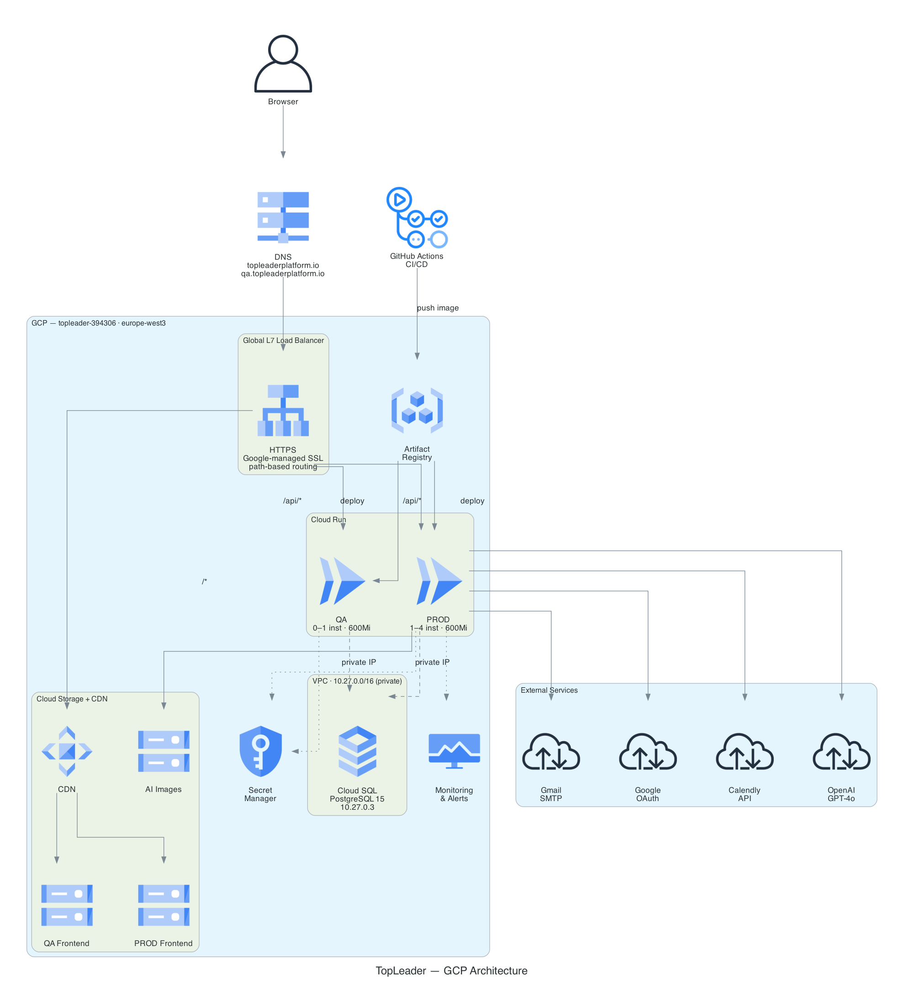

# TopLeader — GCP Cloud Architecture

**Project ID:** `topleader-394306`
**Region:** `europe-west3` (Frankfurt)
**Zone:** `europe-west3-a`
**Managed by:** Terraform + GitHub Actions

---

## Architecture Overview



> Generated from [`architecture_diagram.py`](architecture_diagram.py) using [Python diagrams](https://diagrams.mingrammer.com/).
> Regenerate: `cd docs && python3 architecture_diagram.py`

---

## Architecture Diagram (ASCII)

```
                          INTERNET
                              │
              ┌───────────────┴───────────────┐
              │                               │
     qa.topleaderplatform.io        topleaderplatform.io
       34.36.149.115 (HTTP)          34.144.216.127 (HTTP)
       34.160.238.170 (HTTPS)        34.128.134.109 (HTTPS)
              │                               │
              ▼                               ▼
  ┌─────────────────────┐        ┌─────────────────────┐
  │  Global L7 Load     │        │  Global L7 Load     │
  │  Balancer — QA      │        │  Balancer — PROD    │
  │                     │        │                     │
  │  Managed SSL cert   │        │  Managed SSL cert   │
  │  (Google-managed)   │        │  (Google-managed)   │
  │                     │        │                     │
  │  URL routing:       │        │  URL routing:       │
  │  /api/*      ──┐    │        │  /api/*      ──┐    │
  │  /login      ──┤    │        │  /login      ──┤    │
  │  /swagger-ui ──┤    │        │  /login/google─┤    │
  │  /actuator/* ──┤    │        │  /login/cal.. ─┤    │
  │  default     ──┼──► │        │  default     ──┼──► │
  └────────────────┼────┘        └────────────────┼────┘
         BE ◄──────┘                     BE ◄─────┘
         │                               │
         ▼                               ▼
  ┌─────────────────┐           ┌─────────────────┐
  │ Serverless NEG  │           │ Serverless NEG  │
  │ top-be-qa-      │           │ top-be-prod-    │
  │ cloudrun        │           │ cloudrun        │
  └────────┬────────┘           └────────┬────────┘
           │                             │
           ▼                             ▼
  ┌─────────────────┐           ┌─────────────────┐
  │ Cloud Run (QA)  │           │ Cloud Run (PROD)│
  │ top-leader-qa   │           │ top-leader-prod │
  │                 │           │                 │
  │ min: 0          │           │ min: 1          │
  │ max: 1          │           │ max: 4          │
  │ CPU: 1          │           │ CPU: 1          │
  │ RAM: 600 MB     │           │ RAM: 600 MB     │
  │ concurrency: 80 │           │ concurrency: 80 │
  │ timeout: 300s   │           │ timeout: 300s   │
  │ session affin.  │           │ session affin.  │
  │ VPC egress:     │           │ VPC egress:     │
  │ private-only    │           │ private-only    │
  └────────┬────────┘           └────────┬────────┘
           │                             │
           │  VPC network: top-leader-vpc │
           │  Subnetwork: top-leader-vpc  │
           └──────────────┬──────────────┘
                          │ Private IP
                          ▼
              ┌───────────────────────┐
              │   Cloud SQL           │
              │   top-leader-db       │
              │                       │
              │   PostgreSQL 15       │
              │   ENTERPRISE edition  │
              │   db-custom-1-3840    │
              │   (1 vCPU, 3.75 GB)   │
              │   disk: 10 GB SSD     │
              │   auto-resize: on     │
              │   ZONAL availability  │
              │                       │
              │   Private IP:         │
              │   10.27.0.3           │
              │   Public IP: on       │
              │   (local dev only)    │
              │                       │
              │   Backups: daily 09:00│
              │   retention: 7 days   │
              │   PITR: enabled       │
              │   Query insights: on  │
              │   SSL: required       │
              └───────────────────────┘

         FRONTEND (static files)
         ┌──────────────────────────────────────┐
         │         Cloud Storage (GCS)           │
         │                                       │
         │  www.qa.topleaderplatform.io          │
         │  → EUROPE-WEST3, website bucket       │
         │  → CDN enabled (1h TTL)               │
         │                                       │
         │  www.topleaderplatform.io             │
         │  → EU multi-region, website bucket   │
         │  → CDN enabled (1h TTL)               │
         │                                       │
         │  ai-images-top-leader                 │
         │  → EU multi-region                    │
         │  → AI-generated article images        │
         └──────────────────────────────────────┘

         LB default_service → Backend Bucket (GCS + CDN)
         LB /api/* path     → Backend Service → Serverless NEG → Cloud Run
```

---

## GCP Components Detail

### Cloud Run

| Property | QA (`top-leader-qa`) | PROD (`top-leader-prod`) |
|----------|----------------------|--------------------------|
| Region | europe-west3 | europe-west3 |
| Min instances | 0 (scale to zero) | 1 (always warm) |
| Max instances | 1 | 4 |
| CPU | 1 vCPU | 1 vCPU |
| Memory | 600 MB | 600 MB |
| Concurrency | 80 req/instance | 80 req/instance |
| Timeout | 300s | 300s |
| CPU throttling | yes (idle) | yes (idle) |
| Startup CPU boost | yes | yes |
| Session affinity | yes | yes |
| VPC egress | private-ranges-only | private-ranges-only |
| VPC network | top-leader-vpc | top-leader-vpc |
| Service account | App Engine default SA | App Engine default SA |
| Image source | Artifact Registry | Artifact Registry |

### Cloud SQL

| Property | Value |
|----------|-------|
| Instance name | `top-leader-db` |
| Engine | PostgreSQL 15 |
| Edition | ENTERPRISE |
| Tier | `db-custom-1-3840` (1 vCPU, 3.75 GB RAM) |
| Disk | 10 GB SSD, auto-resize enabled |
| Availability | ZONAL (europe-west3-a) |
| Private IP | `10.27.0.3` (via VPC peering) |
| Public IP | enabled (local dev via Cloud SQL Auth Proxy) |
| SSL | ENCRYPTED_ONLY (enforced) |
| Backups | Daily at 09:00 UTC, 7-day retention, EU region |
| PITR | enabled (7-day transaction log retention) |
| Query Insights | enabled (5 plans/min, 1024 char query length) |
| Deletion protection | yes |

### VPC Network

| Property | Value |
|----------|-------|
| Network name | `top-leader-vpc` |
| Type | Auto-create subnetworks |
| Private IP range | `/16` (VPC peering for Cloud SQL) |
| Service networking | `servicenetworking.googleapis.com` peering |
| Cloud Run egress | `private-ranges-only` (all private traffic via VPC) |

### Load Balancers

#### QA Load Balancer

| Property | Value |
|----------|-------|
| Type | Global External HTTPS (L7) — EXTERNAL_MANAGED |
| HTTP IP | `34.36.149.115` |
| HTTPS IP | `34.160.238.170` |
| Domain | `qa.topleaderplatform.io` |
| SSL | Google-managed certificate (`qa-topleaderplatform-io-cert2`) |
| Backend (API) | Serverless NEG → Cloud Run `top-leader-qa` |
| Backend (static) | Backend Bucket → GCS `www.qa.topleaderplatform.io` + CDN |
| CDN | yes (frontend only, API CDN disabled) |
| Routing rules | `/api/*`, `/login`, `/swagger-ui/*`, `/v3/*`, `/actuator/*` → Cloud Run |

#### PROD Load Balancer

| Property | Value |
|----------|-------|
| Type | Global External HTTPS (L7) — EXTERNAL_MANAGED |
| HTTP IP | `34.144.216.127` |
| HTTPS IP | `34.128.134.109` |
| Domain | `topleaderplatform.io` |
| SSL | Google-managed certificate (`topleaderplatform-io-cert`) |
| Backend (API) | Serverless NEG → Cloud Run `top-leader-prod` |
| Backend (static) | Backend Bucket → GCS `www.topleaderplatform.io` + CDN |
| CDN | yes (frontend only, API CDN disabled) |
| Routing rules | `/api/*`, `/login`, `/login/google`, `/login/calendly` → Cloud Run |

### Artifact Registry

| Property | Value |
|----------|-------|
| Repository | `top-leader` |
| Format | Docker |
| Region | europe-west3 |
| Image path | `europe-west3-docker.pkg.dev/topleader-394306/top-leader/top-leader-be` |
| QA tags | `latest`, `qa-{short-sha}` (keep last 2) |
| PROD tags | `{version}` e.g. `0.0.21` (keep last 3) |

### Cloud Storage (GCS)

| Bucket | Location | Purpose |
|--------|----------|---------|
| `www.qa.topleaderplatform.io` | EUROPE-WEST3 | QA frontend static files + CDN |
| `www.topleaderplatform.io` | EU (multi-region) | PROD frontend static files + CDN |
| `ai-images-top-leader` | EU (multi-region) | AI-generated article images |
| `topleader-terraform-state` | — | Terraform state backend |

### Secret Manager

All secrets accessed by Cloud Run at runtime:

| Secret | Used in |
|--------|---------|
| `SPRING_DATASOURCE_PASSWORD_PROD` | PROD DB password |
| `SPRING_DATASOURCE_PASSWORD_QA` | QA DB password |
| `SPRING_MAIL_PASSWORD` | Gmail SMTP password |
| `SPRING_AI_OPENAI_APIKEY` | OpenAI API key |
| `TOP_LEADER_CALENDLY_CLIENT_SECRETS` | Calendly OAuth secret |
| `GOOGLE_CLIENT_CLIENT_SECRET` | Google OAuth secret |
| `GOOGLE_CLIENT_CLIENT_ID` | Google OAuth client ID (QA only) |
| `GRAFANA_OTLP_TOKEN` | Grafana observability token |
| `JOB_TRIGGER_PASSWORD` | HTTP Basic Auth for scheduled jobs |
| `TAVILY_API_KEY` | Tavily web search API key |

### Cloud Scheduler

Scheduled jobs call Cloud Run `/api/protected/jobs/*` endpoints via HTTP Basic Auth.

#### PROD jobs

| Job | Schedule | Endpoint | Description |
|-----|----------|----------|-------------|
| `unscheduled-session-reminder-prod` | `0 7 * * *` (daily 07:00 UTC) | `/remind-sessions` | Remind users with no scheduled sessions |
| `complete-session-prod` | `0 2 * * *` (daily 02:00 UTC) | `/mark-session-completed` | Auto-complete pending sessions older than 48h |
| `feedback-notifications-prod` | `0 0 * * *` (daily midnight) | `/feedback-notification` | Trigger 360° feedback reminders |
| `message-undisplayed-prod` | `0 */4 * * *` (every 4h) | `/displayedMessages` | Notify users about unread messages |

#### QA jobs

All QA jobs currently use `0 0 1 1 *` (disabled — only runs Jan 1st).

### DNS

| Zone | Domain | DNSSEC |
|------|--------|--------|
| `topleaderplatform-io` | `topleaderplatform.io.` | yes (rsasha256) |
| `toplead` | `toplead.app.` | no |

DNS records managed in Terraform (A records pointing to Load Balancer IPs).

### IAM — Service Accounts

| Service Account | Roles | Used by |
|-----------------|-------|---------|
| `topleader-394306@appspot.gserviceaccount.com` (App Engine default) | `secretmanager.secretAccessor`, `cloudsql.client` | Cloud Run runtime |
| Compute default SA | `secretmanager.secretAccessor`, `cloudsql.client` | Cloud Run compute |
| `deploy-service@topleader-394306.iam.gserviceaccount.com` | `run.admin`, `iam.serviceAccountUser` | GitHub Actions deployments |
| `cloud-scheduler-jobs@...` | `run.invoker` (commented out) | Cloud Scheduler → Cloud Run |

### Monitoring & Alerting

| Alert | Condition | Notification |
|-------|-----------|--------------|
| `Topleader-prod error` | Log metric `topleader-metrics` > 0 for 300s | Email |
| `Cloud Scheduler Job Failed` | Log severity >= ERROR for `cloud_scheduler_job` | Email |

Notification channels: email + optional SMS (E.164 format).
Auto-close: 30 min after last trigger.

---

## CI/CD Pipeline

```
GitHub (top-leader-cz/top-leader-be)
          │
          ├── PR to develop/main
          │       └── [build job]
          │               ├── Gradle build
          │               ├── Tests (PostgreSQL TestContainers)
          │               └── Jacoco coverage check (min 80%)
          │
          ├── Tag: qa-deploy / qa-deploy-*
          │       └── [deploy-qa job]
          │               ├── docker build + push to Artifact Registry
          │               │     tags: :latest, :qa-{short-sha}
          │               ├── gcloud run services replace service-qa.yaml
          │               ├── Cleanup old revisions (keep 2)
          │               └── Cleanup old images (keep 2 qa-*, del untagged)
          │
          ├── Tag: qa-native-*
          │       └── [deploy-qa-native job]
          │               ├── GraalVM native image via docker/build-push-action
          │               │     (provenance: false, sbom: false)
          │               ├── gcloud run services replace service-qa.yaml
          │               ├── Cleanup old revisions (keep 2)
          │               └── Cleanup old native images (keep 2)
          │
          └── Tag: release-v*.*.*
                  └── [deploy-prod job]
                          ├── docker build + push to Artifact Registry
                          │     tag: :{version}
                          ├── gcloud run services replace service-prod.yaml
                          ├── Verify deployed image digest matches expected
                          ├── Cleanup old revisions (keep 3)
                          ├── Cleanup old images (keep 3 versions, del untagged)
                          └── gh release create (auto-generated notes)

Auth: GCP_CREDENTIALS (JSON key in GitHub Secret)
      → Service account: deploy-service@topleader-394306.iam.gserviceaccount.com
```

---

## Terraform State

| Property | Value |
|----------|-------|
| Backend | GCS |
| Bucket | `topleader-terraform-state` |
| Prefix | `terraform/state` |
| Provider | `hashicorp/google ~> 5.0` |
| Required Terraform | `>= 1.5.0` |
